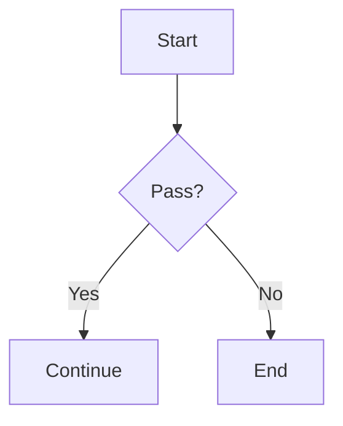

# DocuGenius Converter Skill

> Bi-directional document conversion for Claude Code / OpenClaw

[](https://github.com/anthropics/claude-code)
[](https://www.python.org/downloads/)
[](LICENSE)

**DocuGenius Converter** is an **Agent Skill** that gives **Claude Code / OpenClaw** bi-directional document conversion capabilities. Once installed, your AI can:

- **Office/PDF → Markdown**: Convert Word, Excel, PowerPoint, and PDF files into AI-friendly Markdown for analysis
- **Markdown → Word**: Export Markdown as a **professionally formatted Word document** with automatic styles and layout
- **Mermaid diagram export**: During Markdown → Word conversion, automatically render Mermaid code blocks as embedded images

## Why Do You Need This Skill?

Claude Code / OpenClaw can only read Markdown and plain text files by default. When you hand it a Word, Excel, or PDF file, the AI cannot understand its contents.

This skill solves that problem:

- Let the AI "read" Office documents and PDFs
- Convert documents into Markdown that the AI can analyze directly
- Supports round-trip conversion (Markdown back to Word)

## Features

### Document Conversion

| Direction | Supported Formats | Capabilities |
| --- | --- | --- |
| **Office/PDF → Markdown** | .docx, .xlsx, .pptx, .pdf | Headings, lists, tables, formatting |
| **Markdown → Word** | .md | Professional layout, style preservation, Mermaid → image |

### Intelligent Content Extraction

- **Heading detection**: Automatically recognizes Word heading levels (Heading 1–6) and Chinese heading styles
- **Format preservation**: Retains bold, italic, and other inline formatting
- **Table conversion**: Converts tables to clean Markdown format
- **List support**: Ordered, unordered, and nested lists
- **Mermaid diagrams**: Renders Mermaid code blocks via `mmdc (mermaid-cli)` and embeds them as PNG images for maximum Word compatibility

### Lightweight & Token-Efficient

Unlike general-purpose skills that write conversion code on the fly, DocuGenius Converter ships with pre-built conversion scripts:

- **Single call, immediate result**: The AI doesn't need to reason about how to handle the file or write code — it just calls the pre-built script and gets a structured result back
- **Saves tokens**: No more multi-round "write code → run → error → fix" loops; one call returns the converted content
- **Deterministic output**: Conversion logic lives in the script, not in the AI's runtime output — results are consistent and predictable
- Core Python dependencies total only 10–15 MB (Mermaid high-fidelity rendering adds a Node browser dependency)
- **Auto-install**: Missing dependencies are installed to the user directory on first run

## Installation

**The AI-native way: just tell your AI to install it.**

Send this to Claude Code or OpenClaw:

```
Install this skill for me: https://github.com/brucevanfdm/docugenius-converter-skill
```

The AI will clone the repo and configure everything automatically. Dependencies are installed on first use — no manual steps required.

### Requirements

- **Python 3.6+** (required)
- **Node.js 14+** (optional, only needed for Markdown → Word)

### Manual Installation (Optional)

If you prefer to do it yourself:

```bash
# macOS/Linux
git clone https://github.com/brucevanfdm/docugenius-converter-skill.git ~/.claude/skills/docugenius-converter

# Windows
git clone https://github.com/brucevanfdm/docugenius-converter-skill.git %USERPROFILE%\.claude\skills\docugenius-converter
```

Dependencies install automatically on first use. If auto-install fails, run manually:

```bash
pip install --user python-docx openpyxl python-pptx pdfplumber
```

## Usage

### Platform Execution Reference

| Environment | Recommended Command | Notes |
| --- | --- | --- |
| **Linux/macOS** | `./convert.sh <file>` | Run shell script directly |
| **Windows PowerShell** | `.\convert.ps1 <file>` | Recommended, full UTF-8 support |
| **Windows Git Bash** | `powershell.exe -Command "Set-Location '<skill-dir>'; .\convert.ps1 '<file>'"` | Calls PowerShell from Git Bash |
| **Windows CMD** | `convert.bat <file>` | Legacy, may have encoding issues |

**Inside Claude Code / OpenClaw on Windows**, the agent typically runs in Git Bash, so use the PowerShell approach:

```bash
powershell.exe -Command "Set-Location 'C:\path\to\docugenius-converter-skill'; .\convert.ps1 'C:\path\to\file.docx'"
```

### Conversation Examples

Once the skill is installed, just talk to Claude Code / OpenClaw naturally:

#### Analyze a document

```
Summarize the contents of report.docx
```

```
Read data.xlsx and give me a summary of the data
```

#### Convert formats

```
Convert document.pdf to Markdown
```

```
Export notes.md as a Word document
```

#### Mermaid diagram export

Write a Mermaid code block in your Markdown — it will be rendered as an image in the exported Word file:

````markdown

````

If Mermaid rendering fails, the conversion won't break — it gracefully falls back to a plain code block.

#### Batch processing

```
Convert all files in the docs folder
```

## How It Works

When you ask Claude Code / OpenClaw to process a document:

1. **Detect intent**: The AI recognizes a request to handle an Office/PDF/Markdown file
2. **Call the conversion script**: Runs `./convert.sh` or `python scripts/convert_document.py`
3. **Auto-process**:
   - Detects Python environment
   - Validates file format
   - Auto-installs any missing dependencies (to user directory, no virtualenv needed)
   - Runs the conversion
4. **Return result**: Returns a JSON payload with the Markdown content and output path
5. **Respond**: The AI reads the converted content and answers your question

### Output Location

Converted files are saved alongside the original:

```
your-project/
├── report.docx              # original
├── document.md              # original
├── Markdown/                # Office/PDF → Markdown output
│   └── report.md
└── Word/                    # Markdown → Word output
    └── document.docx
```

## Supported Formats

| Format | Input | Output | Quality |
| --- | --- | --- | --- |
| Word (.docx) | ✅ | ✅ | Excellent |
| Excel (.xlsx) | ✅ | ❌ | Excellent |
| PowerPoint (.pptx) | ✅ | ❌ | Good |
| PDF (.pdf) | ✅ | ❌ | Depends on file type |
| Markdown (.md) | ✅ | ✅ | Excellent |

> **Note**: Legacy formats (.doc, .xls, .ppt) are not supported. Please convert them to modern formats first.

## FAQ

### Missing dependencies?

The skill auto-detects and installs dependencies. If that fails, install manually:

```bash
pip install --user python-docx openpyxl python-pptx pdfplumber
```

### File too large?

Current limit is 100 MB. Consider splitting the file or reducing content.

### Markdown → Word failing?

You need Node.js and the npm dependencies:

```bash
cd scripts/md_to_docx
npm install
```

### Mermaid not rendering as images?

Check these two things first:

1. Node.js and npm are available (`node -v`, `npm -v`)
2. Mermaid dependencies are installed (`cd scripts/md_to_docx && npm install`)

If it still fails, the conversion won't abort — the document will fall back to the raw Mermaid code block.

## Best Practices

1. **Use modern Office formats** (.docx, .xlsx, .pptx)
2. **Prefer text-based PDFs** over scanned images; run OCR first if needed
3. **Keep files under 50 MB** for best performance

## Project Structure

```
docugenius-converter-skill/
├── SKILL.md                 # Agent Skill definition
├── convert.sh               # Runner script (macOS/Linux)
├── convert.bat              # Runner script (Windows CMD)
├── convert.ps1              # Runner script (Windows PowerShell, recommended)
├── requirements.txt         # Python dependencies (reference)
├── scripts/
│   ├── convert_document.py  # Core conversion script (with auto-install)
│   └── md_to_docx/         # Markdown → Word module
├── references/
│   └── supported-formats.md # Format support details
└── tests/                   # Test files

Auto-installed dependency locations:
~/.local/lib/python*/site-packages/   # Linux/macOS
%APPDATA%\Python\Python*\site-packages\  # Windows
```

## Technical Details

### Dependencies

| Package | Size | Purpose |
| --- | --- | --- |
| python-docx | ~2 MB | Word processing |
| openpyxl | ~3 MB | Excel processing |
| python-pptx | ~2 MB | PowerPoint processing |
| pdfplumber | ~5 MB | PDF processing |

## License

MIT License
